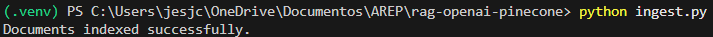
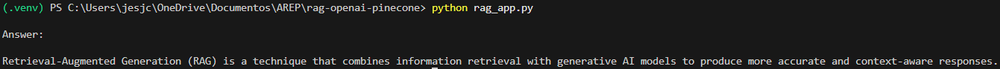
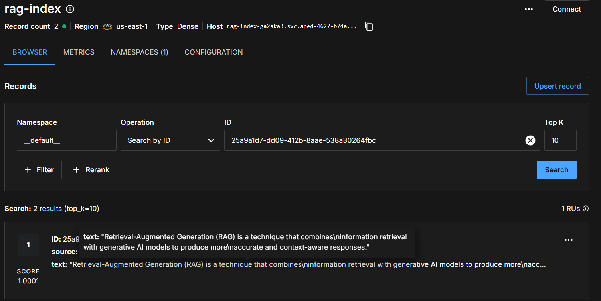

# RAG with Google Gemini and Pinecone

A minimal **Retrieval-Augmented Generation (RAG)** demo using:

- **Google Gemini** for embeddings + chat completions (via `langchain-google-genai`)
- **Pinecone** as the vector database (via `langchain-pinecone`)
- **LangChain (LCEL)** to compose the retrieval + prompt + LLM pipeline

This repo contains two scripts:

- `ingest.py`: loads a text file, chunks it, creates/uses a Pinecone index, and upserts embeddings.
- `rag_app.py`: runs a simple RAG query against Pinecone and prints the answer.

## How it works (high level)

1. **Ingestion**
	 - Load `data/sample.txt`
	 - Split into overlapping chunks
	 - Embed each chunk with Gemini embeddings (`models/gemini-embedding-001`, 3072 dimensions)
	 - Store vectors in Pinecone

2. **RAG Query**
	 - Embed the user question
	 - Retrieve top-k similar chunks from Pinecone
	 - Feed the retrieved context into a prompt
	 - Ask Gemini to answer **only using the provided context**

---

## Prerequisites

- Python **3.10+** (3.11 recommended)
- A **Pinecone** account + API key
- A **Google AI (Gemini)** API key

---

## Setup

### 1) Create a virtual environment

#### Windows (PowerShell)

```powershell
python -m venv .venv
.\.venv\Scripts\Activate.ps1
python -m pip install --upgrade pip
```

#### macOS / Linux

```bash
python3 -m venv .venv
source .venv/bin/activate
python -m pip install --upgrade pip
```

### 2) Install dependencies

```bash
pip install -r requirements.txt
```

---

## Configuration (.env)

This project uses `python-dotenv` to load environment variables from a `.env` file.

Create a file named `.env` at the repo root:

```env
# Required
GOOGLE_API_KEY=your_google_api_key_here
PINECONE_API_KEY=your_pinecone_api_key_here
PINECONE_INDEX=rag-demo-index
```

### Environment variables

- `GOOGLE_API_KEY` (required)
	- Used by both embeddings and the chat model.
- `PINECONE_API_KEY` (required)
	- Used to create/connect to Pinecone.
- `PINECONE_INDEX` (required)
	- The Pinecone index name.

---

## Run the project

### Step A — Ingest documents into Pinecone

This will:

- Create the index if it does not exist
- Use **cosine** similarity
- Create a **serverless** index in **AWS / us-east-1**
- Set vector dimension to **3072** (must match Gemini embedding output)

Run:

```bash
python ingest.py
```

Expected output:

```text
Documents indexed successfully.
```



### Step B — Ask a RAG question

Run:

```bash
python rag_app.py
```

The query is currently hard-coded inside `rag_app.py`:

```python
query = "What is RAG?"
```



Answer match with content in ```data/sample.txt```

In Pinecone:



## Project structure

```text
.
├─ ingest.py            # Loads + chunks + embeds + upserts to Pinecone
├─ rag_app.py           # Retrieves context from Pinecone and queries Gemini
├─ requirements.txt
├─ README.md
└─ data/
	 └─ sample.txt        # Example document
```

---

## Customization

### Use your own data

Replace `data/sample.txt` with your content, or change the loader path in `ingest.py`:

```python
loader = TextLoader("data/sample.txt")
```

### Tune chunking

In `ingest.py`, adjust:

- `chunk_size` (default: 500)
- `chunk_overlap` (default: 50)

```python
splitter = RecursiveCharacterTextSplitter(
		chunk_size=500,
		chunk_overlap=50,
)
```

### Retrieval depth (top-k)

In `rag_app.py`:

```python
retriever = vectorstore.as_retriever(search_kwargs={"k": 4})
```

Increase `k` for more context (potentially more noise/cost) or decrease for tighter answers.

### Change model

The chat model is currently:

```python
ChatGoogleGenerativeAI(model="gemini-2.5-flash", temperature=0)
```

You can switch to a different Gemini model available in your environment.

---

## Troubleshooting

### 1) "Missing" environment variables

Symptoms:

- `PINECONE_API_KEY` or `GOOGLE_API_KEY` is `None`
- Authentication errors

Fix:

- Confirm `.env` exists in the repo root
- Confirm variable names match exactly:
	- `GOOGLE_API_KEY`
	- `PINECONE_API_KEY`
	- `PINECONE_INDEX`

### 2) Pinecone index already exists with different dimensions

If your index exists but was created with a different dimension than **3072**, ingestion or retrieval may fail.

Fix options:

- Delete the existing index and re-run `python ingest.py`, or
- Set `PINECONE_INDEX` to a new name in `.env`.

### 3) Region / cloud mismatch

`ingest.py` creates a serverless index in `aws / us-east-1`:

```python
ServerlessSpec(cloud="aws", region="us-east-1")
```

If you need another location, edit those values.

### 4) Dependency issues

If you see import errors, try:

```bash
pip install -r requirements.txt --upgrade
```

Also confirm you are using the same Python where dependencies were installed (`which python` on macOS/Linux, `Get-Command python` on PowerShell).